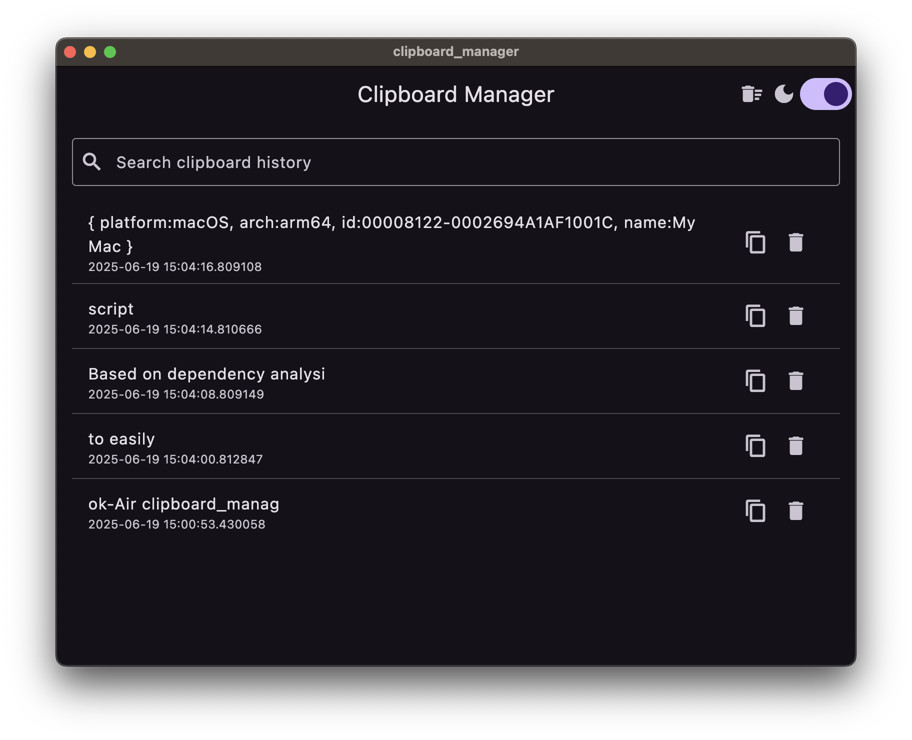
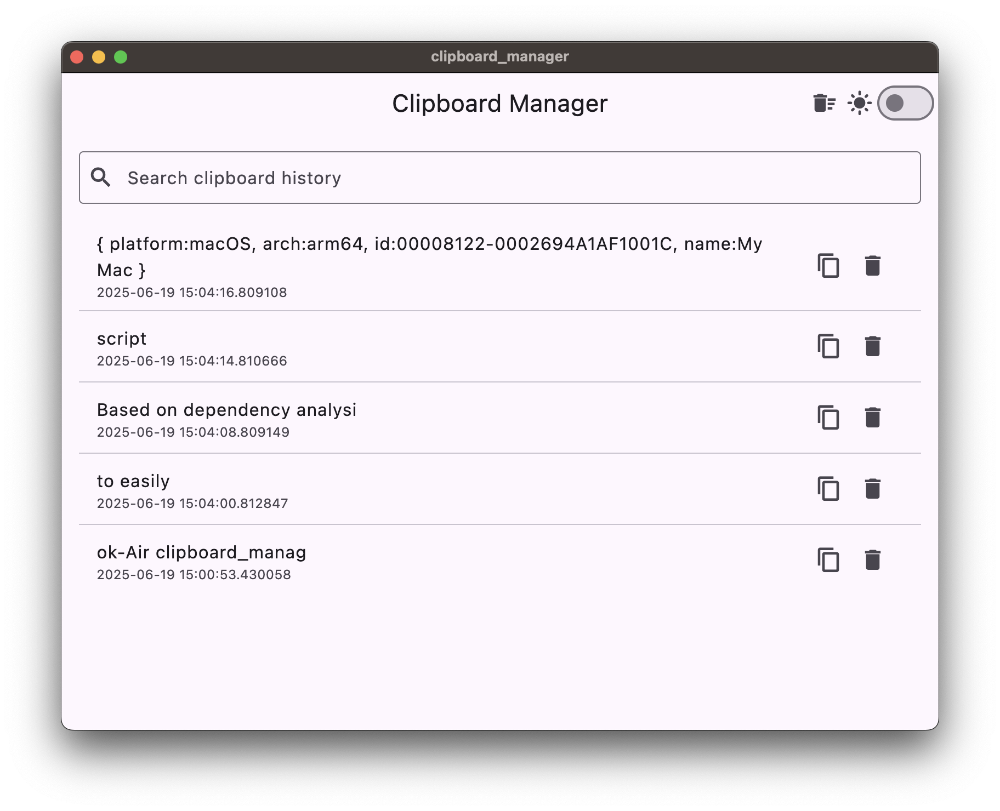
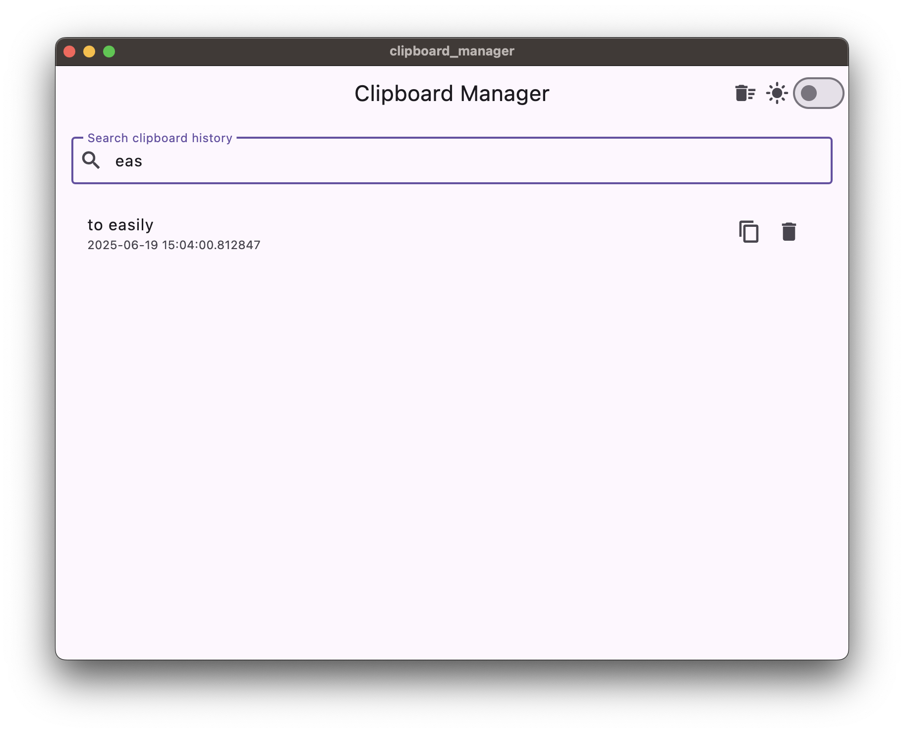

# Clipboard Manager

An offline, cross-platform clipboard manager desktop app built with Flutter Desktop. The app automatically logs copied text snippets, allows searching , and saves data locally using SQLite. It features a clean and responsive UI with dark and light themes that persist across app launches.

---

## Features

- **Clipboard History Tracking:** Automatically records every copied text entry.
- **Searchable History:** Quickly find previous clipboard items with fuzzy search.
- **Persistent Local Storage:** All clipboard data is saved locally in a SQLite database for offline access.
- **Theme Switcher:** Toggle between dark and light mode with your preference saved and applied on app launch.

## Screenshots

### Dark Mode

### Light Mode

### Search Feature

### How It Works

The app listens for clipboard changes and saves new text snippets to a local SQLite database. 
The UI allows users to view their clipboard history, search entries. 
The theme toggle button switches the app between dark and light modes, saving the preference locally so that the chosen theme is applied every time the app launches.
